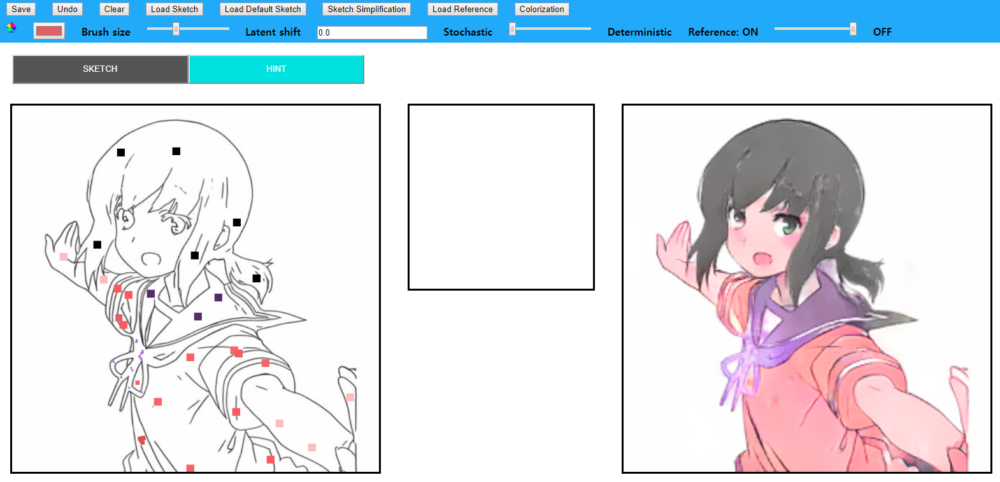

# Line-Art-Colorization-SPADE

### Acknowldegements
- We used code from https://github.com/NVlabs/SPADE
  - Please follow LICENSE.md
- utils/sketchKeras
  - We used code from https://github.com/lllyasviel/sketchKeras
  - Please follow utils/sketchKeras/LICENSE
- utils/preprocessing/sketch_simplification
  - We used code from https://github.com/bobbens/sketch_simplification
  - Please follow utils/preprocessing/sketch_simplification/LICENSE
- dataloader/
  - We referred https://github.com/richzhang/colorization-pytorch
  - Please follow dataloader/LICENSE
# Contents
- Installation
- Preparing Dataset
- Training
- Deploy Demo
## Installation
```
Required version of packages

CUDA 10.1
Keras 2.2.5
tensorboard 1.15.0
tensorflow 1.14.0
pytorch 1.2.0
torchvision 0.4.0
```
- Clone our repository to your directory.
- Install the python modules required with
```
pip install -r requirements.txt
```
## Preparing Dataset
### Safebooru csv download
- Get safebooru metadata and url CSV from https://www.kaggle.com/alamson/safebooru/download
- Parse the safebooru dataset with some tags with utils/tag_parser.py
  - We used solo, white_background tags.
```
usage: tag_parser.py [-h] [--savedir SAVEDIR] [--metadata *.csv]
                     [--tag_list TAG_LIST [TAG_LIST ...]]
                     [--ignore [IGNORE [IGNORE ...]]]

Download images from given metadata.

optional arguments:
  -h, --help            show this help message and exit
  --savedir SAVEDIR     directory to save parsed_metadata
  --metadata *.csv      csv file which contains metadata(urls)
  --tag_list TAG_LIST [TAG_LIST ...]
                        Tags that you want to parse
  --ignore [IGNORE [IGNORE ...]]
                        Tags that you do not want to parse

example : tag_parser.py --savedir safebooru --metadata all_data.csv --tag_list solo white_background tag1 tag2 ... --ignore chibi monster pokemon ....
```
- download images with utils/image_downloader.py using data.csv from utils/tag_parser.py
  - About 50% of images have wrong url. Don't worry!
  - Please download the images in data/safebooru/[FOLDER_NAME]
  - image_downloader.py will automatically make "[SAVEDIR]/color" folder.
```
usage: image_downloader.py [-h] [--savedir SAVEDIR] [--metadata *.csv] [--size SIZE]

Download images from given metadata.

optional arguments:
  -h, --help         show this help message and exit
  --savedir SAVEDIR  directory to save images
  --metadata *.csv   csv file which contains metadata(urls)
  --size SIZE     max length of downloaded images (defualt: Original Image size)
```
### Get Sketch from Color Image
- This part we heavily borrowed code from https://github.com/lllyasviel/sketchKeras
- get mod.h5 from https://github.com/lllyasviel/sketchKeras/releases
  - The mod.h5 file should be in utils/sketchKeras
  - get sketch with utils/sketchkeras/main.py
  ```
   python main.py --target_dir data/safebooru/[FOLDER_NAME]
  ```
  - this code will make "pured", "enhanced", "original" folders and save sketches in the folders.
  - each folder name means different post-processing methods.

### Sketch_simplification
- This part we borrowed from https://github.com/bobbens/sketch_simplification
- Download model_gan.pth from https://mega.nz/#F!2lUn1YbY!JhTkB1vdaBMeTCSs37iTVA
  - https://github.com/bobbens/sketch_simplification/pull/12
  - save the model_gan.pth as ./preprocessing/sketch_simplification/model.pth
- get line art using ./preprocessing/sketch_simplification/simplify.py or ./preprocessing/sketch_simplification/simplify.sh
  - Please change the directory to data/safebooru/[FOLDER_NAME]/[sketch or line]/[pure, enhanced, original]
## Training
- This part we heavily borrowed code from https://github.com/NVlabs/SPADE
- train the model with train.py
  - You can see options with
  ```
  python train.py --help
  ```
  - We used train.py as
  ```
  python train.py --name test --dataset_mode safebooru --dataroot data/safebooru/train_upper_body_768 --tf_log --batchSize 8 --gpu_ids 0 --sample_Ps 2 22 2 --use_vae --netG spadeladder --L2_loss --no_vgg_loss --booru_loss --lr 0.0002 --SGDR --hsv_aug 0.1
  ```
## Testing
- For testing, use test.py. It will inference and save images in results/[EXP_NAME]
  ```
  python test.py --name test --dataset_mode safebooru --dataroot data/safebooru/test_upper_body_768 --batchSize 8 --gpu_ids 0 --use_vae --netG spadeladder
  ```
## Deploy Demo
- You can make a demo server with demo/flask_test.py
- flask_test.py will use 0.0.0.0. You can change port with --port option.
- You should give a directory of pretrained sketchKeras and sketch simplification model with -sk, -s option.
```
python flask_test.py -s utils/preprocessing/sketch_simplification/model.pth --gpu_ids 0 --netG spadeladder --name test --checkpoints_dir checkpoints -sk utils/sketchKeras/mod.h5 --use_vae --port PORT
```
